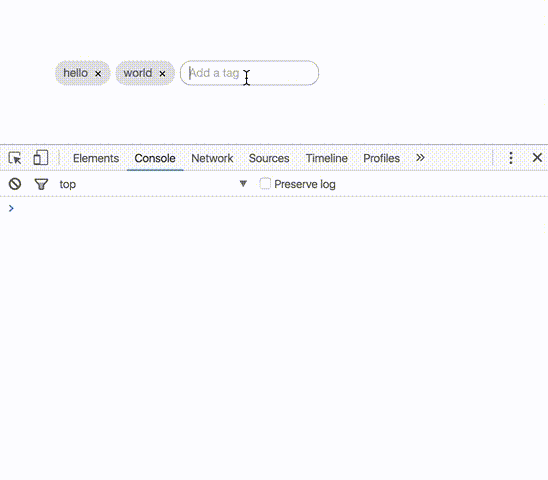

# react-tagging-input

[![Build Status][build-image]][build-url]

[![peerDependency Status][peer-dep-image]][peer-dep-url]
[![devDependency Status][dev-dep-image]][dev-dep-url]

[![MIT][mit-image]][mit-url]
[![npm][npm-version-image]][npm-url]

> Simple tagging component.

### Demo
https://jfusco.github.io/react-tagging-input



## Getting Started ##

#### Installation
From the root of your project.
```sh
npm install react-tagging-input --save
```

## Usage
Simple implementation of tags. See [options available](#options) below.
```js
import React, { Component } from 'react';
import { render } from 'react-dom';
import Tags from 'react-tagging-input';

class Application extends Component{
	constructor(props){
		super(props);

		this.state = {
			tags: ['hello', 'world']
		}
	}

	onTagsChange(tags){
		console.log(`new tags: ${tags}`);
	}

	render(){
		return (
			<div>
				<Tags
				 initialTags={this.state.tags}
				 placeholder="Add a tag"
				 onChange={this.onTagsChange} />
			</div>
		);
	}
}

render(<Application />, document.getElementById('application'));
```

<a name="options"></a>
#### Options
* **[`initialTags`](#initialTags)**
* **[`placeholder`](#placeholder)**
* **[`addKeys`](#addKeys)**
* **[`onChange`](#onChange)**
* **[`onAdded`](#onAdded)**
* **[`onRemoved`](#onRemoved)**
* **[`maxTags`](#maxTags)**
* **[`readOnly`](#readOnly)**
* **[`removeTagIcon`](#removeTagIcon)**
* **[`uniqueTags`](#uniqueTags)**
* **[`id`](#id)**

<a name="initialTags"></a>
##### initialTags ~ optional ~ default `[]`
An `array` of tags to be passed in and rendered right away in the component
```js
const tags = ['hello', 'world'];

<Tags initialTags={tags} />
```

<a name="placeholder"></a>
##### placeholder ~ optional ~ default `null`
A `string` used as placeholder text in the tags input field
```js
<Tags placeholder="Add a tag" />
```

<a name="addKeys"></a>
##### addKeys ~ optional ~ default `[13, 9, 32]`
An `array` of keyCodes used to tell the tags component which delimiter to use to add a tag

[Here](https://developer.mozilla.org/en-US/docs/Web/API/KeyboardEvent/keyCode) is more info and a list of keyCodes
```js
<Tags addKeys={[13, 9, 32, 188]} />
```

<a name="onChange"></a>
##### onChange ~ optional
A `function` fired anytime there is a change - returns the new `array` of tags
```js
onTagsChange(tags){
	console.log(`new tags: ${tags}`);
}

<Tags onChange={this.onTagsChange} />
```

<a name="onAdded"></a>
##### onAdded ~ optional
A `function` fired when a new tag is added - returns a `string` of the new tag
```js
onTagAdded(tag){
	console.log(`new tag: ${tags}`);
}

<Tags onAdded={this.onTagAdded} />
```

<a name="onRemoved"></a>
##### onRemoved ~ optional
A `function` fired when a new tag is deleted - returns a `string` of the tag that was deleted
```js
onTagRemoved(tag){
	console.log(`deleted tag: ${tag}`);
}

<Tags onRemoved={this.onTagRemoved} />
```

<a name="maxTags"></a>
##### maxTags ~ optional ~ default `-1` (infinite)
An `integer` representing the maximum number of tags that are allowed to be added
```js
<Tags maxTags={10} />
```

<a name="readOnly"></a>
##### readOnly ~ optional ~ default `false`
A `boolean` that sets the tag component to read only mode. No adding or removing tags and pointer events
```js
<Tags readOnly={true} />
```

<a name="removeTagIcon"></a>
##### removeTagIcon ~ optional ~ default `"x"`
The `element` to be used for the delete icon
```js
const removeIcon = () => {
	return (
		<i class="my-custom-icon"></i>
	);
}

<Tags removeTagsIcon={removeIcon()} />
```

<a name="uniqueTags"></a>
##### uniqueTags ~ optional ~ default `false`
A `boolean` that allows the same tag to be added more than once
```js
//-- Only allow unique tags to be added
<Tags uniqueTags={true} />
```

<a name="id"></a>
##### id ~ optional ~ default `null`
The `string` to be used for the ID of the component
```js
<Tags id="my-tags-component" />
```

## Styling
#### Installation
Import the main SCSS file in to your application SCSS files
```scss
@import "node_modules/react-tagging-input/src/component/scss/styles.scss";
```

There are a few variables set to `!default` that can be overriden. If you need to change it more just override the actual styles.

**Any overriden variables needs to go above the `@import` statement to take effect**
```scss
//-- Global UI
$tag-base-height
$tag-base-font-size
$tag-base-border-radius
$tag-base-font-color
$tag-base-margin
$tag-base-font-family

//-- Tags
$tag-background-color
$tag-background-hover-color
$tag-remove-color
$tag-remove-font-size
$tag-remove-hover-color

//-- Input
$tag-input-bg-color
$tag-input-border
$tag-input-placeholder-color
```

If you don't care to override variables and just want to override actual styles you may choose to import the minified compiled version of the css instead
```scss
@import "node_modules/react-tagging-input/dist/styles.css";
```

## Tests ##
```
npm test
```

[build-image]: https://travis-ci.org/JFusco/react-tagging-input.svg?branch=master
[build-url]: https://travis-ci.org/JFusco/react-tagging-input
[mit-image]: https://img.shields.io/npm/l/react-tagging-input.svg?style=flat-square
[mit-url]: https://github.com/JFusco/react-tagging-input/blob/master/LICENSE
[npm-version-image]: https://img.shields.io/npm/v/npm.svg?maxAge=2592000
[npm-url]: https://www.npmjs.com/package/react-tagging-input
[dev-dep-image]: https://david-dm.org/JFusco/react-tagging-input/dev-status.svg
[dev-dep-url]: https://david-dm.org/JFusco/react-tagging-input?type=dev
[peer-dep-image]: https://david-dm.org/JFusco/react-tagging-input/peer-status.svg
[peer-dep-url]: https://david-dm.org/JFusco/react-tagging-input?type=peer
